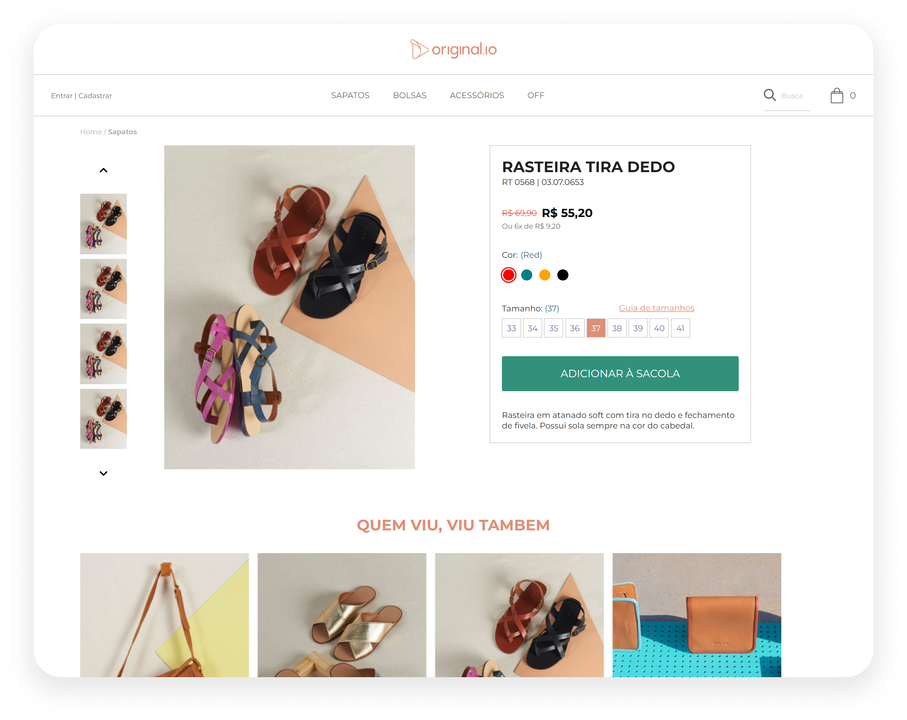
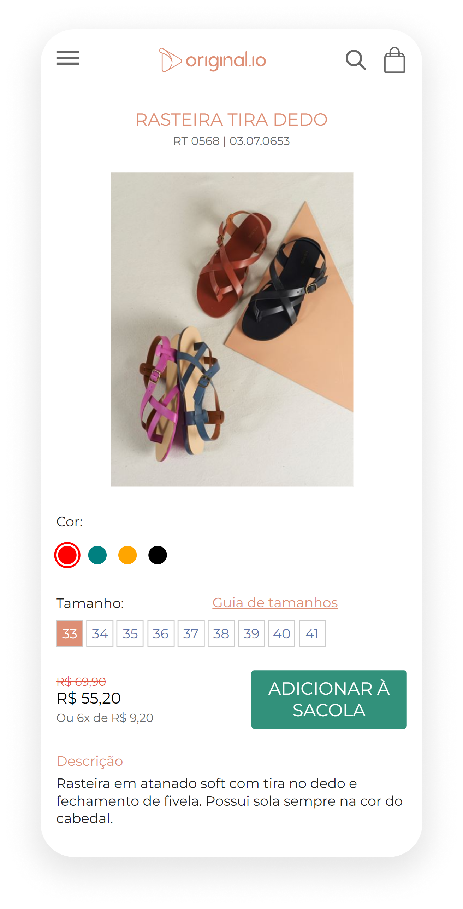

## First challenge of the Tech Summer internship program.

In this challenge, we used the [`Vite`](https://vitejs.dev), [`TypeScript`](https://www.typescriptlang.org) and [`Sass`](https://sass-lang.com) to create a simple product page.

Visit the project [here](https://01-tech-summer.vercel.app/)

### How to use:

    Clone this repository on your computer.
    Open the terminal and navigate to the project folder.
    Run the command: `yarn` to install dependencies.
    Run the command: `yarn dev` to start the development server.
    Open the browser and navigate to `http://localhost:3000`.

### Desktop:

### Mobile:

